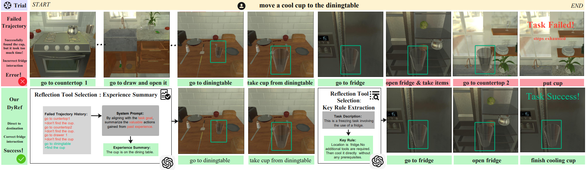
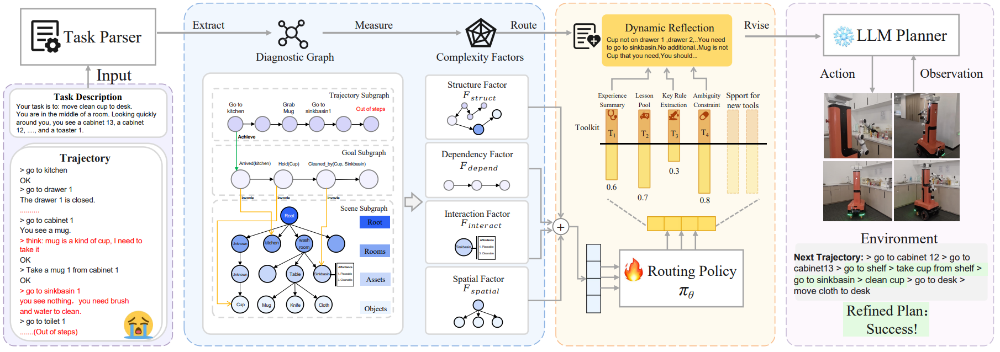
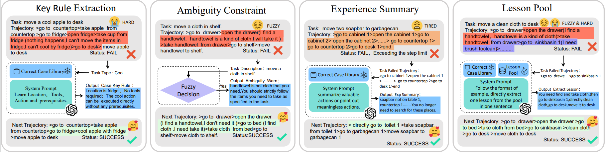

<!-- <h1 align="center"> Flexible Constructivism Reflection for Long-Horizon Robotic Task Planning with Large Language Models </h1> -->

<!--

  IROS 2025

-->

<!--
[author1](https://www.yuque.com/zhangjiatao-grdyv/rn49ht/lq7xzy4xmxgrpgz9), [author2](https://www.yuque.com/zhangjiatao-grdyv/rn49ht/vsarazgdts43o7y4)
-->

## Abstract
Robotic planning tasks often involve diverse complexities, which make adaptive improvement through reflection particularly challenging. Existing LLM-based approaches typically rely on fixed routines, lacking the ability to adjust to task-specific complexity and often leading to redundant reflections.To address this, we propose DyRef a dynamic reflection framework that models tasks as a Diagnostic Graph, measures task complexity through structural factors, and routes them through a Reflection Toolkit via a learned Routing Policy network.This design enables tailored reflection strategies that reduce redundancy and improve reasoning efficiency. Experiments in AlfWorld and on real-world robotic platforms show that DyRef improves success rates by 16.1%, while reducing redundant reflections by 64.4%. Project webpage (anonymized, no author information): https://DyRef.github.io/

## Paper
<iframe  width="400" height="420" src="./DyRef.pdf"></iframe>

<!-- ## Video

  <video id="video" controls="" preload="none" poster="作者(图片地址)">
    <source id="mp4" src="./video1.mp4" type="video/mp4">
  </video>

 -->

## Results
Performance of our DyRef in an AlfWorld example:

  

## Methodology
DyRef dynamically allocates reflection strategy according to task complexity. The pipeline consists of three components: (i) a hierarchical Diagnostic Graph that encodes task structure from descriptions and execution trajectories; (ii) four topological Complexity Factors (Dependency, Interaction, Spatial, Structure) derived from the graph, providing a structured representation of task complexity; (iii) a Routing Policy that leverages these factors to select tools from the Reflection Toolkit, enabling adaptive reflection and plan revision.

  

 

  

## Appendix
### 1.Prompt of Valuable Experience Summary Process

    You will be given the history of a past experience in which you were placed in an environment and given a task to complete. 
    You were unsuccessful in completing the task.
    Now by aligning the task goal, summary the valuable actions you have gained in your past experience.
  
    Here are two examples:
    =================The first example=====================
    {experience[f'{v}_0']}
    
    =================The second example=====================
    {experience[f'{v}_1']}
    
    Here is the history of the past experience and your task:
    {scenario}
    
    Strictly follow the format of example, summarize the valuable actions directly in concise language, without adding your own divergent thoughts.
  

### 2.Prompt of Failure Lesson Summary Process
    You will be given the history of a past experience in which you were placed in an environment and given a task to complete. 
    You were unsuccessful in completing the task.
    Now to solve your mistake, I will give you a mentor lesson pool, in which listed typical constraints of your task environment.
    Analyze which tip in the mentor lesson pool might be the reason of your mistake, and then make failure lesson summarization refer to the form of examples given later. 
    The existed tips in the mentor lesson pool can be your inspirations, but don't be limited by them. Summary failure lessons according to your specific task experience.
    Pay attention, only choose ONE tip in the pool fits your task type, and only choose it when you think it might be reason of your mistake. 

    Here is the mentor lesson pool:
    {mentor_lesson_pool}
    
    Here is your task type, remember to extract one through tips in the pool which precisely contains your task type at the beginning:
    {v}

    Here are two examples:
    {lesson}

    Here is the history of the past experience and your task:
    {scenario}

    Strictly follow the format of example, directly extract one lesson from the pool in one sentence, without adding your own divergent thoughts.

### 3.Prompt of Comprehensive Construction Process
    You will be given the history of a past experience in which you were placed in an environment and given a task to complete. 
    You were unsuccessful in completing the task.
    Now I will give you valuable experience summarization and failure lesson summarization based on your previous experience. 
    Please create a plan for the next attempt with reference to specific actions that you should have taken, incorporating insights from these two analyses. 
    You need to output in the format of the example without any additional redundant content.
    I will give you some examples to help you better understand how to generate plan.
    
    Here are two examples:
    {plan_example}
    
    Here is the history you need for generating plan:
    {scenario}
    
    Here is the valuable experience you need for generating plan:
    {experience}
    
    Here is the failed lesson you need for generating plan:
    {lesson}
